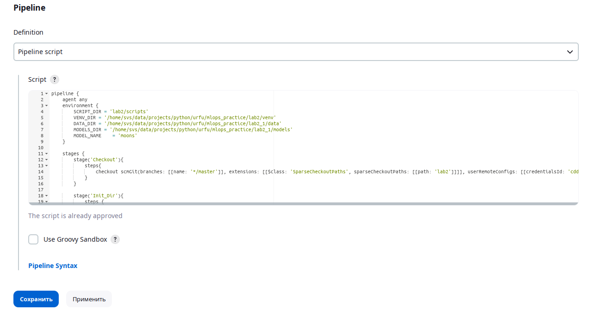
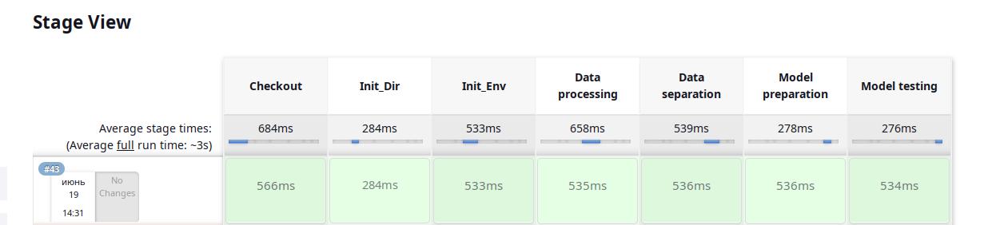
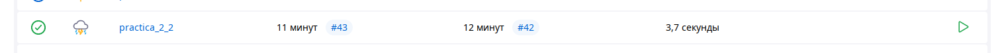

# Module 2

* Вам нужно разработать собственный конвейер автоматизации для проекта машинного обучения. Для этого вам понадобится виртуальная машина с установленным Jenkins, python и необходимыми библиотеками. В ходе выполнения практического задания вам необходимо автоматизировать сбор данных, подготовку датасета, обучение модели и работу модели.
* Разработанный конвеер требуется выгрузить в файл. Так же все скрипты (этапы конвеера требуется сохранить)
* Все файлы необходимо разместить в подкаталоге lab2 корневого каталога
Этапы задания

1. Развернуть сервер с Jenkins, установить необходимое программное обеспечение для работы над созданием модели машинного обучения.
2. Выбрать способ получения данных (скачать из github, из Интернета, wget, SQL запрос, …).
3. Провести обработку данных, выделить важные признаки, сформировать датасеты для тренировки и тестирования модели, сохранить.
4. Создать и обучить на тренировочном датасете модель машинного обучения, сохранить в pickle или аналогичном формате.
5. Загрузить сохраненную модель на предыдущем этапе и проанализировать ее качество на тестовых данных. 
6. Реализовать задания и конвеер. Связать конвеер с системой контроля версий. Сохранить конвеер.

# Работа конвеера:

