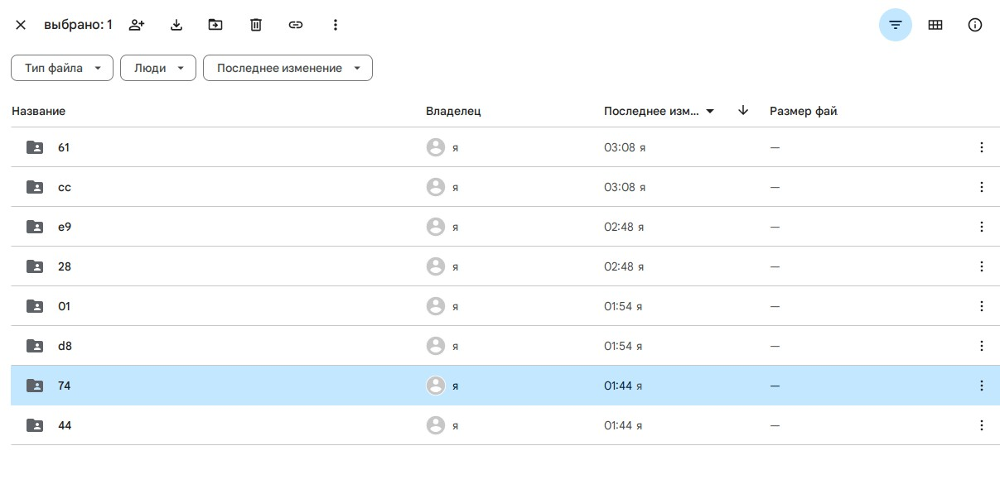

в этом каталоге выполняется 4 задание по версионированию наборов данных

*История изменений:*

*Содержимое удаленного репозитория для датасетов (google disk)*

*Ссылка на удаленный репозиторий:*
https://drive.google.com/drive/folders/1B95HDu6hr3ntvYtNa6jEsrdgjBITI52O

*Пример окна терминала во время работы*

